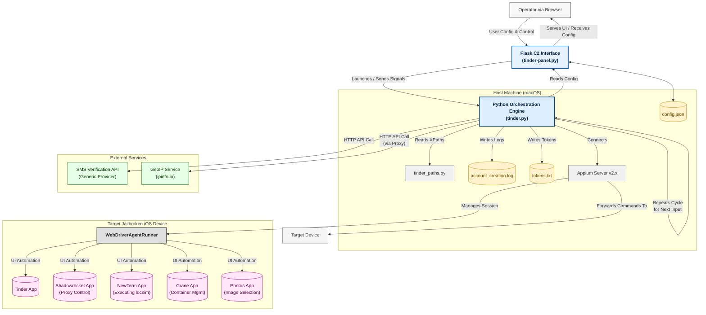

**OMEGA-T: An Orchestrated Mobile Environment Manipulation Framework for Scalable iOS Account Generation Analysis (Tinder Case Study)**

> **Note on Code Availability:** Please be advised that due to the sensitive nature of the automation techniques and potential security risks discussed, the source code files (`.py`) for the OMEGA-T framework are not being released publicly alongside this research paper. Furthermore, no pseudocode beyond the illustrative examples provided within the document will be made available. This decision aligns with responsible disclosure considerations.

**Author:** Neverlow512

**Date:** 02 April 2025

**Classification:** TLP:WHITE (Suitable for Public Release)

**Disclaimer:** *This research documents a framework I developed for academic and educational purposes, aiming to analyze mobile application security postures and automation capabilities. The described system and techniques should not be used for malicious activities or to violate any platform's Terms of Service. I assume no liability for the misuse of this information.*

---

**Executive Summary:**

In this report, I present **OMEGA-T (Orchestrated Mobile Environment Manipulation Framework - Tinder)**, a proof-of-concept system I designed and built to rigorously evaluate the feasibility of automating user account generation at scale on the iOS platform, using Tinder as a representative target. My approach with OMEGA-T effectively integrates headless UI automation via Appium/XCUITest with sophisticated, programmatically controlled manipulation of the mobile operating environment. Key capabilities I implemented include dynamic network proxy configuration leveraging the Shadowrocket application, precision GPS location spoofing via the `locsim` utility, and robust application state isolation using the Crane containerization system, requiring jailbreak instrumentation on the target device. The framework is managed through a custom Flask-based web interface I developed, providing command-and-control (C2) capabilities over a Python-based engine that executes the end-to-end Tinder onboarding workflow. This process encompasses automated SMS verification using external APIs (I decided not to provide the names of the providers due to security risks), detailed profile construction (including configurable handling of interests, habits, and optional fields like school), multi-photo uploads, and navigation of post-registration prompts. OMEGA-T provides a tangible methodology for assessing the resilience of mobile onboarding flows against automated threats that combine UI interaction with environment control. My findings underscore the potential for scaled abuse and serve as crucial groundwork for my subsequent research detailed in *"Breaking the Unbreakable: Analyzing Arkose Labs' CAPTCHA Resilience in iOS Apps"*. Recognizing the sensitivity of automation techniques, I deliberately deferred the public dissemination of this OMEGA-T analysis for approximately six months following my initial validation to mitigate potential immediate risks.

---

**1. Introduction**

**1.1. Research Motivation:** My interest lies in understanding the practical attack surface of widely used mobile applications. The ability to automate account creation at scale is a foundational capability for various offensive security scenarios. Standard UI automation often proves insufficient against modern defenses, leading me to explore integrated approaches that include environment control.

**1.2. Project OMEGA-T Goals:** My primary goals in developing OMEGA-T were to:

*   Engineer a framework capable of orchestrating complex, multi-tool automation sequences on iOS.
*   Demonstrate the integration of UI automation (Appium/XCUITest) with dynamic, on-device environment manipulation tools (proxy managers, location spoofers, containerization).
*   Apply this framework to fully automate the Tinder iOS account registration workflow as a practical case study.
*   Analyze the technical requirements, effectiveness, and security implications of this orchestrated automation approach.

**1.3. Scope and Context:** This research specifically targets the standard Tinder user registration pathway on iOS, beginning with phone number verification and proceeding through profile completion. While I observed advanced anti-bot systems like Arkose Labs in other parts of the application, analyzing and bypassing those specific challenges during *registration* was designated out-of-scope for *this* OMEGA-T study, forming the core of my separate, follow-up research.

**1.4. Contribution:** OMEGA-T serves as a practical demonstration of advanced mobile automation, combining UI control with environment context manipulation. In this report, I detail its architecture (based on my `tinder-panel.py` and `tinder.py` implementation), its core capabilities, the operational workflow I designed, and discuss its utility for both security assessment and understanding potential adversarial tactics. **Recognizing the potential sensitivity surrounding automation techniques capable of bypassing baseline platform controls, I deliberately deferred the public release of this specific OMEGA-T analysis for approximately six months after initially validating the framework's core capabilities to mitigate potential immediate risks associated with sharing such methodologies.** This work also serves as foundational research preceding my subsequent study titled *"Breaking the Unbreakable: Analyzing Arkose Labs' CAPTCHA Resilience in iOS Apps"*.

---

**2. Threat Model & Automation Strategy**

From an offensive simulation perspective, my strategy with OMEGA-T was to overcome limitations of simpler bots by:

*   **Orchestrating Complexity:** Building a system that manages interactions between a Web UI, a Python backend, Appium, the target application (Tinder), specific iOS helper applications (Shadowrocket, NewTerm, Crane), and external web APIs (SMS services, GeoIP).
*   **Implementing Dynamic Context Control:** Actively modifying the network perception (via Shadowrocket proxies), geographical location (via `locsim`), and application state (via Crane containers) for each distinct account creation attempt. This aims to defeat basic fingerprinting tied to static IPs or device state.
*   **Designing for Scalability:** Creating the Flask C2 panel to manage bulk inputs and control automation runs efficiently.
*   **Enhancing Realism:** Incorporating configurable options for profile details (hobbies, habits, etc.) to reduce the homogeneity of generated accounts.
*   **Reproducing Human-Like Behavior:** Unpredictable waiting times, touches, scrolls, and the list goes on. I would prefer to keep the rest for myself as I really don't want these methods to be replicated. 

My core hypothesis was that controlling the *environment* is as critical as controlling the UI for achieving resilient, large-scale automation against mobile platforms.

---

**3. OMEGA-T Framework Architecture**

I designed OMEGA-T with several interconnected subsystems, reflecting the code structure:

*   **1. C2 & Configuration Interface (`tinder-panel.py`):** The Flask web application serves as the operator's console. It handles requests to start, stop, pause, and unpause the automation engine (`tinder.py`). Its frontend uses JavaScript extensively for dynamic form generation, input collection, configuration saving (to `config.json` via a dedicated endpoint and using `localStorage`), and sending commands to the backend. It verifies target device connectivity using `ios-deploy -c` before initiating the core automation script via `subprocess.Popen`, passing all configurations as command-line arguments.
*   **2. Automation & Orchestration Engine (`tinder.py`):** This is the main Python script performing the heavy lifting. It parses command-line arguments, establishes the Appium `webdriver.Remote` session, and executes the `createAccount` function which contains the main workflow logic. It houses helper functions for specific tasks: environment manipulation (`crane`, `deleteContainer`, `switchProxy`, `changeLocation`), SMS API interaction (`buyNumber`, `checkNumber`, `smsHandler`), UI interaction (`click_element`, profile handlers referencing `tinder_paths.py`), and resource management (`deleteUsedPhotos`). It explicitly handles SIGUSR1/SIGUSR2 for pause/unpause functionality via the `signal` module and `check_pause()` polling within its loops. Killswitch logic is implemented based on time and retries passed from the C2. Progress and results are logged.
*   **3. UI Element Definitions (`tinder_paths.py`):** To improve maintainability and unpredictable choices, I externalized the complex XPath locators for Tinder's profile customization screens into this separate Python dictionary, referenced by `tinder.py`.
*   **4. Supporting Infrastructure:**
    *   **Appium Server:** Runs on the host machine, acting as the bridge translating WebDriver commands from the engine into XCUITest actions on the device.
    *   **Target iOS Device:** A jailbroken iPhone running the necessary helper applications (Shadowrocket, NewTerm, Crane) and WebDriverAgentRunner.
    *   **External APIs:** Third-party services for SMS verification and GeoIP lookup.

      
**Architecture Diagram:**



>**This architecture highlights the orchestration required, where the Python engine (`tinder.py`) acts as the central controller, managing interactions between the user configuration (via C2), the target application (via Appium), environmental control tools on iOS (also via Appium), and external web services.**

---

**4. Deep Dive: OMEGA-T Capabilities & Operational Walkthrough**

Here’s a breakdown of the operational sequence I implemented for each account:

**4.1. Initialization:** The process begins with the operator configuring the run via the Flask C2 panel (`tinder-panel.py`), providing necessary inputs and settings. The backend then launches `tinder.py`.

**4.2. Per-Account Dynamic Environment Configuration (Executed by `tinder.py`):** Before attempting registration, the environment is prepared:
*   **State Isolation (Crane):** I implemented the `crane()` function to programmatically interact with the Crane application UI via Appium. It forces Tinder closed, simulates a long-press on the app icon to reveal the Crane menu, navigates Crane to create a new, named container (using a large random number as the name), and ensures Tinder launches within this isolated space.
    ```pseudocode
    // Pseudocode reflecting tinder.py's crane() function logic
    Function IsolateAppStateViaCrane():
        Log("Isolating application state using Crane.")
        TerminateAppProcess("com.cardify.tinder")
        SimulateLongPressOnElement(TinderAppIcon_XPath)
        ClickElement(CraneContextMenu_XPath) // Assumes element appears
        ClickElement(CraneSettings_XPath) // Navigate within Crane UI
        ClickElement(CraneNewContainerButton_XPath)
        ContainerName = GenerateRandomNumberString()
        InputElement(CraneNameField_XPath, ContainerName)
        ClickElement(CraneCreateButton_XPath)
        Log("Created and activated new container: " + ContainerName)
        ActivateAppProcess("com.cardify.tinder") // Relaunch in new container
        Return ContainerName
    ```
*   **Network Context (Shadowrocket):** The `switchProxy()` function orchestrates Shadowrocket. It first calls `deleteOldProxy` to clear the previous configuration via UI automation (clicking 'Sort', selecting the top proxy, clicking 'Delete', confirming). Then, `addProxy` inputs the new proxy details (IP, port, user, pass, type) via Shadowrocket's UI. Finally, `activateNewProxy` selects the newly added entry to route traffic.
    ```pseudocode
     // Pseudocode reflecting tinder.py's switchProxy() logic
     Function ConfigureProxyViaShadowrocket(ProxyString, ProxyType):
         Log("Configuring proxy via Shadowrocket UI automation...")
         ActivateAppProcess("com.liguangming.Shadowrocket")
         If deleteOldProxy(): Log("Old proxy removed.") // Handles finding & deleting
         addProxy(ProxyString, ProxyType) // Handles inputting new details
         activateNewProxy() // Selects the new proxy
         Log("New proxy configured and activated.")
         SwitchToAppProcess("com.cardify.tinder")
    ```
*   **Geo-Location Sync (`locsim`):** The `changeLocation()` function determines the proxy's location by making a web request (using `requests` configured with the active proxy) to `ipinfo.io/json`. It then automates the NewTerm app UI, typing `locsim start -x LAT -y LON` with the retrieved coordinates and hitting 'Return'.
    ```pseudocode
     // Pseudocode reflecting tinder.py's changeLocation() logic
     Function SpoofLocationViaLocsim(ProxyString, ProxyType):
         Log("Synchronizing GPS location to proxy exit node...")
         GeoData = GetGeoFromIPInfoViaProxy(ProxyString, ProxyType)
         Coordinates = GeoData['loc']
         Log("Target coordinates: " + Coordinates)
         ActivateAppProcess("com.googlecode.newterm")
         InputElement(NewTermTerminal_XPath, 'locsim start -x ' + LAT + ' -y ' + LON)
         ClickElement(NewTermReturnKey_XPath)
         Log("locsim command executed.")
         SwitchToAppProcess("com.cardify.tinder")
    ```

**4.3. Automated Onboarding Execution (`createAccount` function in `tinder.py`):** This function executes the ~30 UI steps within the now-configured environment: SMS verification (using `buyNumber`, `smsHandler`), core profile input (email, name, DOB, gender, prefs), extended profile (using `handle_habits`, `handle_what_makes_you_you`, `handle_hobbies`, `handle_school_page` based on C2 config and `tinder_paths.py`), photo uploads (automating the Photos app UI), and handling final prompts/consents. My `click_element` and `send_keys_with_retry` wrappers provide robustness against minor timing delays.

**4.4. Operational Control & Cleanup:** Pause/Resume is handled via signal trapping and the `check_pause()` poll. The killswitch logic monitors time/retries within `createAccount`. If configured (`savecontainers=false`), `deleteContainer` is called on success/failure to remove the Crane container via UI automation. `deleteUsedPhotos` cleans up the photo album via UI automation. Basic run metadata (inputs used) is saved.

---

**5. Tooling & Environment Specification**

The successful implementation and operation of the OMEGA-T framework relies on a specific configuration for both the target iOS device and the host control machine:

**5.1. Target iOS Device:**
*   **Hardware:** iPhone 8 - 12
*   **Operating System:** iOS 15.7+
*   **Condition:** **Jailbroken.** A jailbroken state (e.g., via checkra1n, palera1n, dopamine etc.) is a fundamental requirement to enable the necessary system-level access for environment manipulation tools.
*   **Required iOS Tools/Tweaks:**
    *   **Package Manager:** Cydia / Sileo / Zebra (as provided by the specific jailbreak).
    *   **Location Spoofing:** `locsim` (Jailbreak Tweak).
    *   **Terminal Emulator:** NewTerm (or compatible alternative installed via package manager).
    *   **Application Containerization:** Crane (Jailbreak Tweak/Application).
    *   **Proxy Management:** Shadowrocket (Commercial App Store application).
    *   **Anti-Detection Measures:** Standard, community-developed anti-jailbreak-detection tweaks were employed to ensure target application functionality within the jailbroken research environment. Analysis of these specific bypasses was not within the scope of OMEGA-T.

**5.2. Host Control Machine:**
*   **Operating System:** **macOS** Sonoma. Required for Xcode dependency and iOS device interaction tooling.
*   **Core Development Environment:**
    *   **Xcode:** Full Xcode installation including Command Line Tools (essential for Appium's XCUITest driver and device interaction). Standard signing configuration for WebDriverAgentRunner within Xcode is assumed.
    *   **Node.js & NPM:** Required for installing and running the Appium server.
    *   **Homebrew:** Used for installing supporting libraries and dependencies.
*   **Automation & Orchestration Software:**
    *   **Appium Server:** v2.x, installed globally via NPM.
    *   **Appium XCUITest Driver:** installed via `appium driver install`.
    *   **Python:** Version 3.x.
    *   **Key Python Libraries:**
        *   `Appium-Python-Client` v2.7.1
        *   `Flask` (for the C2 web interface)
        *   `Requests` (for external API communication)
        *   `pysocks` (for proxy support in `requests`)
        *(Note: Standard installation via `pip3` is assumed for these libraries)*
*   **Device Interaction Utilities:**
    *   `libimobiledevice` suite (via Homebrew).
    *   `ios-deploy` (via Homebrew).

---

**6. Observed Effectiveness & Operational Constraints**

+   *During testing periods, I observed high success rates using OMEGA-T under controlled conditions: typically over 90% for accounts targeted in European regions and around 80% for those in the US. This validates the viability of the orchestrated approach. Interestingly, I also noted variations in the subsequent lifespan or stability of the generated accounts, suggesting potential downstream detection or limitations imposed by the platform even after successful onboarding, though a deep analysis of these post-creation factors was outside OMEGA-T's primary scope.*
+   *While I cannot tell these for sure, security seems much more strict in the USA region. During some days, the success rate was under 30%. I didn't delve too deep into this as it was not one of my objectives. However, Tinder seems to have an interesting pattern of cycles where it improves security during some days of the week or times of the month*

*   **Effectiveness:** I found OMEGA-T to be highly effective in automating the Tinder onboarding under controlled conditions, validating the orchestrated approach for an indefinite number of accounts, all running at the same time. (I consider this a major flaw, however, very hard to predict and defend against)
*   **Constraints:**
    *   **UI Brittleness:** The primary operational challenge is the framework's sensitivity to Tinder UI updates breaking XPath locators. However, with basic path recognition adaptation, this can dynamically be overcome.
    *   **Toolchain Stability:** Success depends on the consistent behavior of Appium and all integrated iOS tools (Shadowrocket, NewTerm, `locsim`, Crane, anti-JB tweaks). From my extensive tests, this hasn't been an issue in most scenarios and security measures need to be seriously taken care of in this regard.
    *   **Jailbreak Requirement:** This inherently limits applicability for normal users but opens an entire new environment, full of exploits for potentially malicious protagonists.
    *   **Detection:** While bypassing basic checks, I assess that the automation patterns are likely detectable by sophisticated behavioral analysis. However, mimicking human behaviour, taking unpredictable breaks, "making mistakes" when tapping, and randomly changing behavior has shown that the app's detection mechanisms are not sophisticated enough to stop well-designed bots.

---

**7. Security Implications & Red Team Utility**

My development of OMEGA-T highlights:

*   **Limitations of Basic Defenses:** SMS verification and simple IP checks are demonstrably insufficient against orchestrated attacks controlling the environment.
*   **Limitations of Advanced Defenses:** Jailbreak, Device ID, location, and fingerprint detection mechanisms can be bypassed by advanced software and need urgent upgrades.
*   **Value of Environment Control:** Programmatic manipulation of network, location, and state significantly enhances automation resilience.
*   **Feasibility of Scaled Abuse:** Such frameworks make large-scale generation of accounts for malicious purposes viable. Some malicious actors could use these vulnerabilities to their advantage, abusing the system.

---

**8. Potential Mitigations (Defensive Considerations)**

Based on my findings, effective defenses would likely involve:

*   Server-side behavioral analysis focusing on interaction timings and sequences specific to onboarding.
*   Advanced device/environment attestation beyond simple checks.
*   Risk-based deployment of stronger challenges (e.g., advanced CAPTCHAs) during onboarding if automation indicators are detected. However, these have to be unexpected and not only present during the account creation process. While they might be frustrating for the regular users, these security mechanisms need to be adapted to appear randomly at certain points, whenever the account is being used.
*   Robust jailbreak detection and response mechanisms. Implementation of reliable location detection, beyond simple checks as not even checking the region and language of the phone is not enough. 

---

**9. Future Research Directions (if necessary)**

OMEGA-T provides a solid foundation. My immediate next steps involve:

*   **UI Resilience:** Exploring more robust element identification methods, implementing advanced ML-based behavior and path recognition.
*   **Advanced Evasion:** Researching techniques to counter more sophisticated fingerprinting and behavioral analysis.
*   **Analyzing Advanced Defenses:** Leveraging the OMEGA-T framework and methodology to systematically analyze and develop bypass techniques for advanced anti-bot systems. This is the focus of my next report: **"Breaking the Unbreakable: Analyzing Arkose Labs' CAPTCHA Resilience in iOS Apps"**.

---

**10. Conclusion**

Through the design and implementation of OMEGA-T, I have demonstrated the practical feasibility of achieving scalable, automated account generation on Tinder for iOS by integrating UI automation with dynamic control over the application's perceived environment (network via Shadowrocket, location via `locsim`, state via Crane) on multiple jailbroken devices. The framework architecture (`tinder-panel.py`, `tinder.py`) provides a powerful tool for security analysis. While challenges like UI fragility and dependency on specific tools exist, OMEGA-T validates that sophisticated automation is achievable, highlighting significant security implications and paving the way for my subsequent research into bypassing advanced bot mitigation systems like Arkose Labs (already completed but not published). 

---
